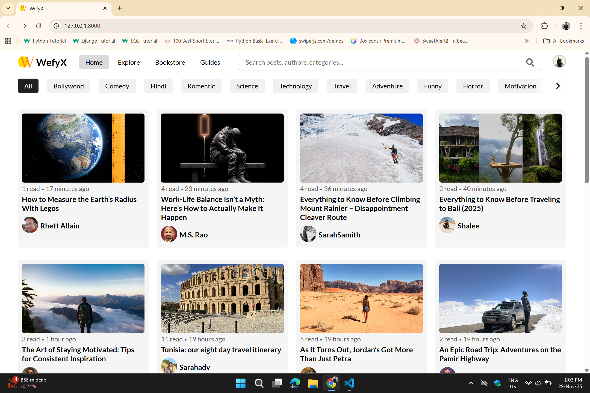
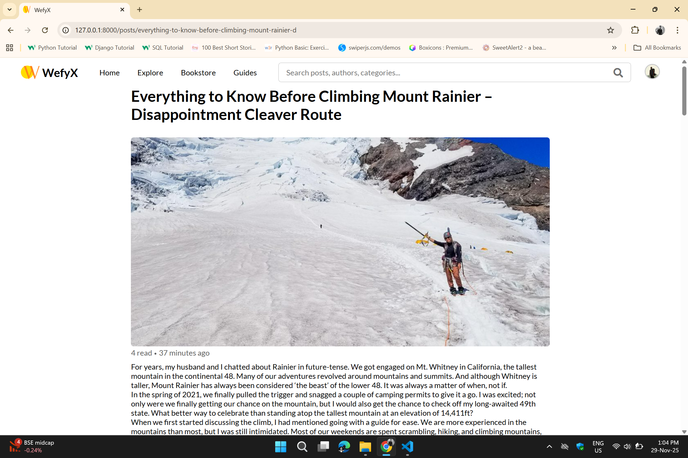
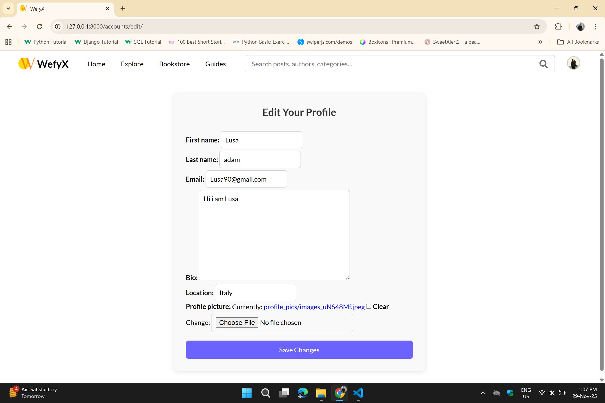
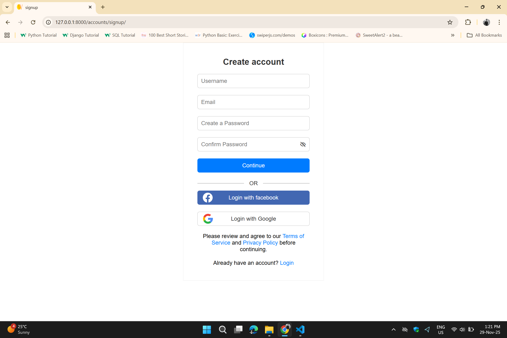
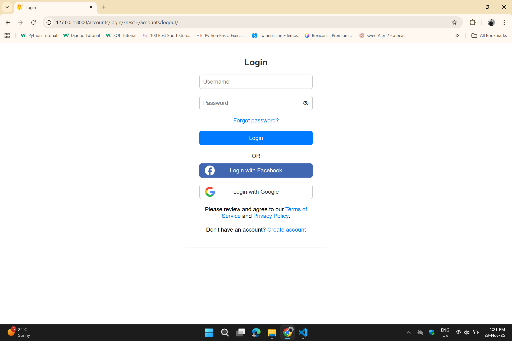

# 📝 Wefyx — Blogging Platform

Wefyx is a full-featured blogging platform built using **Django**, designed for seamless content discovery and interaction.  
Users can read and explore blogs, follow creators, manage profiles, filter posts by category, and create their own blogs.

---

## 🚀 Features

### 👥 User Management
- User login and signup
- Forgot password / password reset
- Profile creation and updates (name, bio, profile picture)
- View other bloggers' profiles
- Follow / unfollow bloggers

### 📰 Blog Features
- Create, edit, and delete blog posts
- Categorize posts (Technology, Travel, Adventure, Lifestyle, etc.)
- Explore Recent Posts and trending blogs
- Filter blogs by category
- Search blogs by title or keywords
- View a blogger’s complete post history

### ❤️ Social Features
- Follow / unfollow creator profiles
- Personalized feed based on users you follow
- See follower and following count

---

## 🏗️ Tech Stack

| Layer | Technology |
|-------|------------|
| Backend | Django, Django ORM |
| Frontend | HTML, CSS, JavaScript|
| Database | SQLite|
| Authentication | Django Auth System |
| Additional | Django Messages Framework, Slug URLs |

---

## 📂 Project Structure
wefyx/
│
├── users/ # User authentication & profile management
├── blogs/ # Blog CRUD & categorization
├── core/ # Main app config
├── templates/ # HTML pages
├── static/ # CSS, JS, Images
└── manage.py

## 📸 Screenshots

### 🏠 Home Page

### 👤 Filter

### 📝 Post View

### 📝 Creater Profile

### 📝 Edit Profile

### 📝 Upload Post

### 📝 Explore Letest and Tranding Post

### 📝 Bookstore

### 📝 Guides

### 📝 Signin Page 

### 📝 Login Page

### 📝 Forgot Password page

### 📝 Reset Password 

